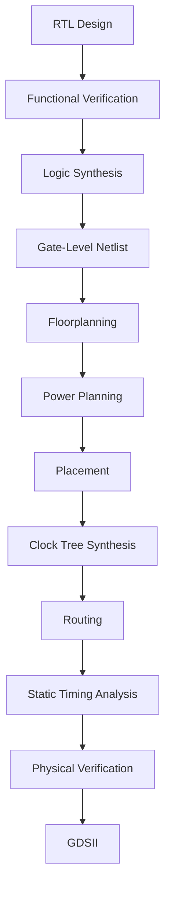
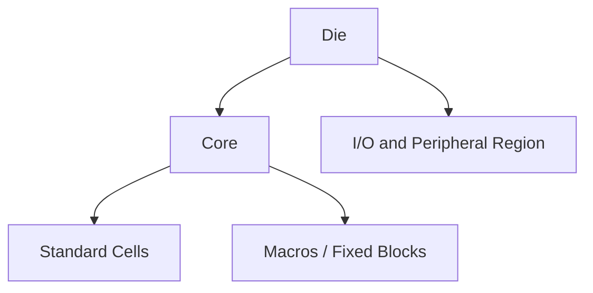
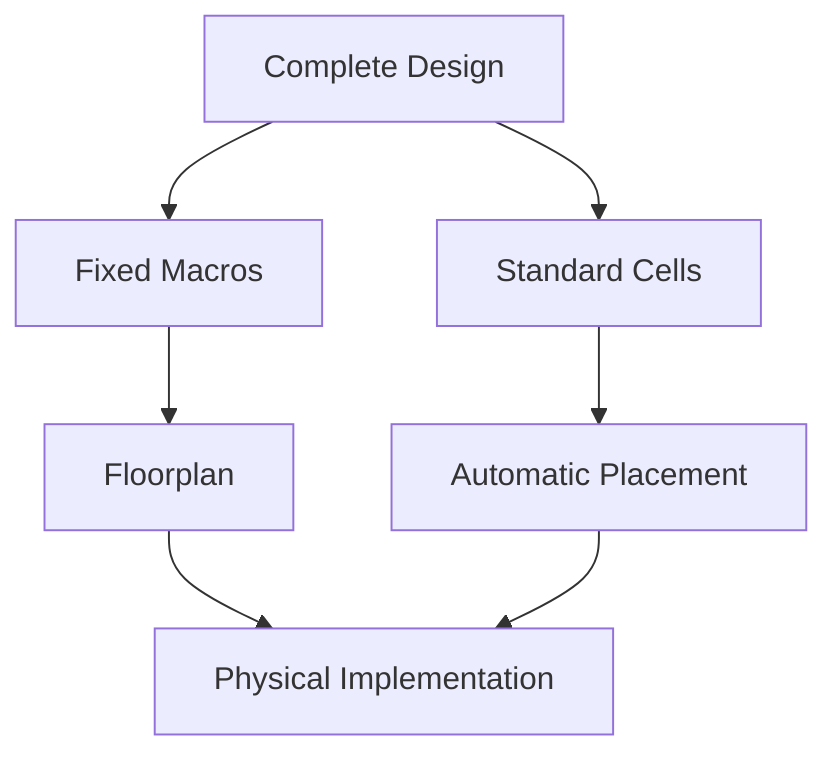
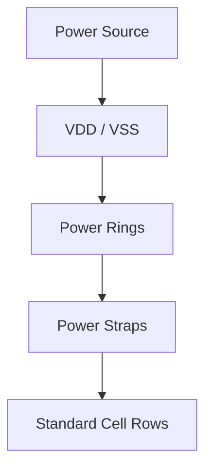
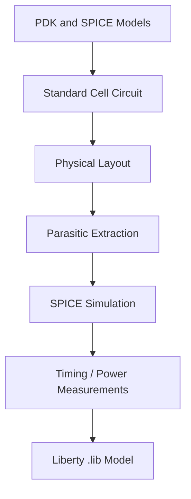
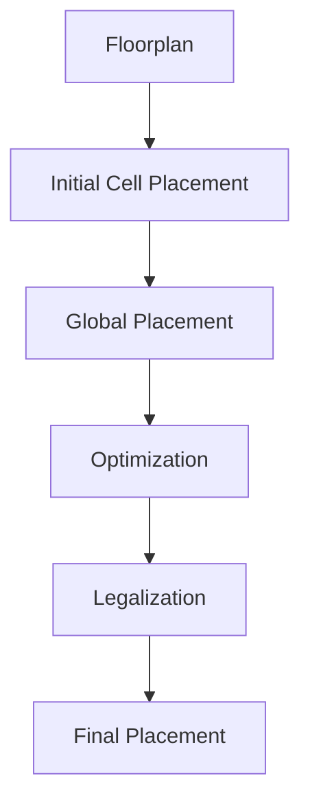
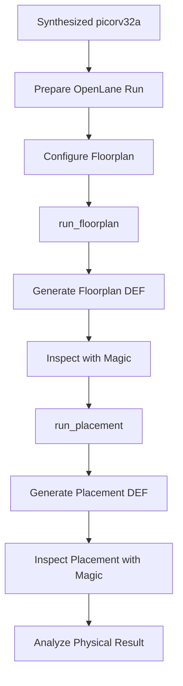

# PHYSICAL-DESIGN-DAY2


# Day 2 — Floorplanning and Placement

## Overview

After synthesis, a digital design is still mainly a logical representation. The gates and their connections are known, but the design has not yet been given a physical location on the chip.

This stage of the physical-design flow starts answering questions such as:

* How large should the chip area be?
* How much space should be allocated to the core?
* Where should the input and output pins be placed?
* Where should fixed blocks or macros be located?
* How should power be distributed across the design?
* Where should the standard cells be placed?
* How can the placement be optimized for timing and routing?

This module focuses on two closely related stages: **floorplanning and placement**.

The practical work uses the `picorv32a` design with the SKY130 technology and OpenLane. The generated floorplan and placement results are then inspected using Magic.

---

## Objectives

The main objectives of this module are:

* Understand the purpose of floorplanning in physical design.
* Understand the relationship between die area and core area.
* Understand utilization and aspect ratio.
* Understand how macros and other fixed blocks are handled.
* Understand the purpose of decoupling capacitors.
* Understand basic power planning.
* Understand I/O pin placement.
* Understand placement blockages.
* Understand how standard cells are physically placed.
* Understand why placement affects timing and routing.
* Run the floorplan stage using OpenLane.
* Run the placement stage using OpenLane.
* Inspect the generated DEF files.
* Visualize the floorplan and placement using Magic.
* Relate the tool output to the concepts of physical design.

---

# 1. Where Floorplanning and Placement Fit in the ASIC Flow

Floorplanning and placement are not performed directly on the original RTL.

The design first passes through synthesis, where the RTL is converted into a gate-level netlist using cells from the target standard-cell library.

The simplified flow is:



This module mainly concentrates on:

```text
Gate-Level Netlist
        |
        v
   Floorplanning
        |
        v
  Power Planning
        |
        v
     Placement
```

The important transition here is from a **logical design** to a **physical arrangement of that design**.

---

# 2. Floorplanning

Floorplanning is the stage where the overall physical organization of the design is established.

Before individual standard cells are placed, the tool needs to know the approximate physical boundaries of the design.

The main elements considered during floorplanning are:

* Die dimensions
* Core dimensions
* Aspect ratio
* Core utilization
* I/O pins
* Macros
* Power structures
* Placement regions
* Routing resources

A simple representation is:

```text
+-----------------------------------------+
|                  DIE                    |
|                                         |
|       +-------------------------+       |
|       |                         |       |
|       |          CORE           |       |
|       |                         |       |
|       |   Standard Cell Area    |       |
|       |                         |       |
|       +-------------------------+       |
|                                         |
+-----------------------------------------+
```

The floorplan therefore establishes the physical framework within which the remaining implementation stages operate.

---

# 3. Die Area and Core Area

The **die** represents the complete physical area of the chip.

The **core** is the region inside the die where most of the standard-cell logic is implemented.

A simplified relationship is:



The difference between die and core is important because the entire die cannot simply be filled with logic cells.

Space is required for:

* I/O structures
* Power distribution
* Routing
* Physical margins
* Macros
* Other implementation requirements

---

# 4. Aspect Ratio

The aspect ratio describes the shape of the core.

It is generally represented as:

```text
Aspect Ratio = Height / Width
```

For example:

```text
Aspect Ratio = 1

       Width
<---------------->

+----------------+
|                |
|                |
|     CORE       |
|                |
|                |
+----------------+

Square Core
```

An aspect ratio greater than or less than one produces a rectangular core.

The choice of aspect ratio can influence routing and physical organization, so it is part of the initial floorplanning decisions.

---

# 5. Core Utilization

Utilization describes how much of the available core area is occupied by standard cells.

A simplified expression is:

```text
Utilization =
(Cell Area / Core Area) × 100
```

For example, if the cells occupy half of the available core area:

```text
Utilization = 50%
```

Utilization cannot simply be pushed as high as possible.

If the core becomes too crowded, there may not be enough space for:

* Routing
* Buffers
* Clock-tree cells
* Optimization
* Physical adjustments

This creates a trade-off between area efficiency and routability.


The particular run used in this module overrides the general default utilization and uses approximately **35% core utilization**.

This leaves additional physical space for routing and later optimization.

---

# 6. Pre-Placed Cells and Macros

Not every block in an ASIC is treated like an ordinary standard cell.

Large blocks such as:

* SRAMs
* Memories
* Analog IP
* Large digital blocks
* PLLs
* Other reusable IP

are normally handled as larger physical blocks or macros.

Their physical dimensions and interfaces are already known, so they can be assigned fixed locations during floorplanning.

The remaining standard cells are then placed around these fixed regions.



The location of a macro matters because it can influence:

* Wire length
* Congestion
* Timing
* Routing channels
* Power distribution

For this particular `picorv32a` floorplan, the OpenLane log indicates that no macro blocks were detected during I/O placement.

---

# 7. Decoupling Capacitors

A digital circuit can experience temporary fluctuations in its local supply voltage when many cells switch at the same time.

One of the contributors to this problem is **IR drop**.

When current flows through the resistance of the power network, the voltage available at a particular location can decrease.

Decoupling capacitors, commonly called **decaps**, are used as local charge reservoirs.

Conceptually:

```text
Main Power Network
        |
        v
      VDD/VSS
        |
        v
  Decoupling Capacitor
        |
        v
    Standard Cells
```

During a sudden switching event, a decap can temporarily supply local current and help maintain a more stable supply voltage.

This is important because excessive supply variation can affect the behavior and timing of digital cells.

---

# 8. Power Planning

Once the basic floorplan is established, the power network must provide VDD and VSS throughout the core.

A simplified power-distribution structure is:



Instead of depending on a single connection, the power network uses distributed structures such as:

* Power rings
* Power straps
* Standard-cell power rails

This helps distribute current throughout the design.

Power planning needs to consider:

* IR drop
* Ground bounce
* Current density
* Power integrity
* Physical routing resources

The power network therefore becomes an important part of the floorplan rather than something added at the end.

---

# 9. I/O Pin Placement

The RTL describes which signals connect to which modules, but it does not specify where those signals physically enter or leave the chip.

Pin placement assigns physical locations to the I/O pins.

Pins can be distributed around the boundary of the core or die depending on the design requirements.

A simplified view is:

```text
                INPUT / OUTPUT PINS

        +--------------------------------+
        |  o   o   o   o   o   o   o    |
        |                                |
        | o          CORE             o |
        |                                |
        | o                              o |
        |                                |
        |  o   o   o   o   o   o   o    |
        +--------------------------------+
```

Pin locations can affect:

* Wire length
* Routing congestion
* Connectivity to macros
* Timing
* Overall physical organization

For the `picorv32a` design, the I/O placement stage determines the physical locations of the design's ports before standard-cell placement.

---

# 10. Placement Blockages

Some areas of the floorplan should not be used for ordinary standard-cell placement.

These regions can be marked as **placement blockages**.

A blockage may be required when an area is reserved for:

* A macro
* A routing channel
* Power structures
* Special physical cells
* Other fixed structures

Conceptually:

```text
+--------------------------------------+
|                                      |
|     STANDARD CELL REGION             |
|                                      |
|       +----------------+             |
|       |   BLOCKED      |             |
|       |     AREA       |             |
|       +----------------+             |
|                                      |
|     STANDARD CELL REGION             |
|                                      |
+--------------------------------------+
```

Placement blockages provide additional control over where the placement tool can put standard cells.

---

# 11. Placement

After the floorplan has been established, the next step is to determine the physical location of the standard cells.

At the logical level, the netlist contains instances and connections.

At the physical level, each logical instance must correspond to an actual cell from the standard-cell library.

The process can be summarized as:


The placement tool considers several factors simultaneously, including:

* Cell locations
* Wire length
* Congestion
* Timing
* Cell density
* Routing resources

---

# 12. Standard-Cell Libraries

A standard-cell library contains predefined cells that can be used to implement digital logic.

Examples include:

* Inverters
* Buffers
* NAND gates
* NOR gates
* Multiplexers
* Flip-flops
* Logic gates

Cells implementing the same logical function can have different drive strengths.

For example:

```text
Buffer X1
Buffer X2
Buffer X4
Buffer X8
```

A stronger cell generally provides better drive capability, but it may also occupy more area and consume more power.

The placement and optimization stages therefore have to balance timing, area and power.

---

# 13. Placement Optimization

An initial placement is not necessarily the final placement.

After cells are initially positioned, the tool evaluates the quality of the arrangement.

It considers factors such as:

* Estimated wire length
* Capacitance
* Timing
* Congestion
* Cell density

Long connections can result in larger delay and slower signal transitions.

The tool may therefore insert buffers or change cell sizes to improve the path.

A simplified example is:

```text
Without Buffer

Cell ----------------------------- Cell
          Long Connection


With Buffer

Cell -------- Buffer ----------- Cell
```

The buffer breaks a long electrical connection into smaller sections and can improve signal transition characteristics.

Placement optimization is therefore closely connected to timing closure.

---

# 14. Library Characterization

The timing and power information used by synthesis and timing-analysis tools does not appear automatically.

Standard cells are characterized before their information is used by the digital implementation flow.

The characterization process uses circuit-level simulations to determine how a cell behaves under different conditions.

A simplified flow is:



The resulting library information is then used by tools during:

* Synthesis
* Placement
* Static Timing Analysis
* Optimization

---

# 15. Timing Characterization

A standard cell's delay depends on factors such as:

* Input transition
* Output load
* Cell type
* Operating conditions
* Process corner

A basic propagation-delay relationship is:

```text
Propagation Delay =
Output Threshold Crossing Time
-
Input Threshold Crossing Time
```

Similarly, rise and fall transition times are measured using defined voltage thresholds.

This information is stored in timing models and later used by digital EDA tools.

The important idea is that physical design relies on **characterized library data** rather than treating every standard cell as an ideal logic block.

---

# 16. OpenLane Floorplan Configuration

The floorplanning stage is controlled by a number of configuration parameters.

Some important parameters include:

| Parameter          | Purpose                                          |
| ------------------ | ------------------------------------------------ |
| `FP_CORE_UTIL`     | Target core utilization                          |
| `FP_ASPECT_RATIO`  | Core height-to-width relationship                |
| `FP_SIZING`        | Determines how floorplan dimensions are handled  |
| `DIE_AREA`         | Specifies die dimensions when explicitly defined |
| I/O layer settings | Control metal layers used for pins               |
| PDN settings       | Control power-distribution geometry              |

The important point is that these parameters determine how OpenLane constructs the initial physical environment for the design.

---

# 17. Running the Floorplan

After preparing the `picorv32a` design, the floorplan stage can be executed using:

```tcl
run_floorplan
```

At a high level, this stage performs several operations including:

```text
Gate-Level Netlist
        |
        v
Floorplan Generation
        |
        +----> I/O Pin Placement
        |
        +----> Tap Cell Insertion
        |
        +----> Power Distribution Network
        |
        v
Floorplan DEF
```

The resulting DEF file contains physical information describing the generated floorplan.

---

# 18. Floorplan Result

The generated floorplan can be inspected using the resulting DEF and LEF files.

The DEF contains information such as:

* Die boundaries
* Core boundaries
* Cell locations
* I/O locations
* Rows
* Physical structures

For the observed run, the die coordinates in the DEF correspond to approximately:

```text
Width  ≈ 660.7 µm
Height ≈ 671.4 µm
```

This gives a physical die area of roughly:

```text
660.7 × 671.4 µm²
```

The exact interpretation depends on the DEF units specified in the file.

---

# 19. Viewing the Floorplan in Magic

The floorplan can be opened in Magic using the technology file, merged LEF and generated DEF.

Example:

```bash
magic -T /home/vsduser/Desktop/work/tools/openlane_working_dir/pdks/sky130A/libs.tech/magic/sky130A.tech lef read ../../tmp/merged.lef def read picorv32a.floorplan.def &
```

Magic provides a visual representation of the physical design.

At the floorplan stage, the core is not yet filled with all of the standard-cell logic.

Instead, important structures such as:

* I/O pins
* Cell rows
* Tap cells
* Decap cells
* Power structures

can be inspected.

---

# 20. Floorplan Image

The following image shows the generated floorplan in Magic.


At this point, the main objective is not to inspect every individual cell. The important observation is that the physical boundaries and supporting structures have been established before standard-cell placement.

---

# 21. Floorplan Details

A closer view makes structures such as decap cells and I/O pins easier to identify.


The physical view shows that the design is no longer only a logical collection of gates. It now contains actual geometric information associated with the target technology.

This is one of the key transitions from synthesis to physical design.

---

# 22. Running Placement

Once the floorplan is ready, standard cells can be placed inside the available core area.

The placement stage is started using:

```tcl
run_placement
```

A simplified view of the operation is:



The placement process tries to find physical locations for the standard cells while respecting the floorplan and placement constraints.

---

# 23. Placement Result

The placement run for `picorv32a` reports approximately:

```text
Total instances       : 21,699
Fixed instances       : 6,354
Nets                  : 15,449
Design area           : ~420,473 µm²
Placement utilization : ~36%
```

The exact values depend on the particular configuration and tool version used for the run.

One important observation is the difference between the sparse floorplan and the final placement.

The floorplan establishes the empty physical framework.

Placement fills that framework with the standard-cell instances from the synthesized design.

---

# 24. Viewing the Placement in Magic

The placement result can be opened using the placement DEF:

```bash
magic -T /home/vsduser/Desktop/work/tools/openlane_working_dir/pdks/sky130A/libs.tech/magic/sky130A.tech lef read ../../tmp/merged.lef def read picorv32a.placement.def &
```

The resulting layout contains a much denser arrangement of standard cells.


Compared with the earlier floorplan, the main difference is immediately visible: the core is now populated with the actual logic cells generated during synthesis.

---

# 25. Placement Detail

Zooming into the placed design reveals individual standard-cell instances.


Cells such as:

* Flip-flops
* Multiplexers
* Buffers
* Logic gates

can be identified in the physical layout.

This provides a useful connection between the synthesized netlist and the physical implementation.

At the RTL level, these elements are described through hardware behavior.

After synthesis, they become standard-cell instances.

After placement, those instances receive actual physical coordinates.

---

# 26. Floorplan vs Placement

The difference between the two stages can be summarized as follows:

| Floorplanning                       | Placement                             |
| ----------------------------------- | ------------------------------------- |
| Defines die/core boundaries         | Places standard cells                 |
| Establishes physical framework      | Fills the core with logic             |
| Determines macro locations          | Determines individual cell locations  |
| Places I/O pins                     | Optimizes cell arrangement            |
| Creates initial power structures    | Considers timing and wire length      |
| Creates available placement regions | Produces a legalized cell arrangement |

The two stages are closely connected.

A poor floorplan can make placement difficult, while a good floorplan gives the placement engine enough space and flexibility to produce a better implementation.

---

# 27. Relationship Between Placement and Timing

Physical location affects electrical behavior.

Consider a simple path:

```text
Flip-Flop
    |
    v
Logic Cell
    |
    v
Logic Cell
    |
    v
Flip-Flop
```

If the cells are placed far apart, the interconnect becomes longer.

Longer interconnect can introduce:

* Greater capacitance
* Greater resistance
* Increased delay
* More routing resources
* Potential timing problems

Therefore:


This is why placement is not simply a geometric problem. It directly influences later timing analysis.

---

# 28. What the Floorplan Tells Us

The floorplan provides the first physical view of the design.

From the floorplan, we can examine:

* Die dimensions
* Core dimensions
* I/O distribution
* Cell rows
* Power structures
* Tap cells
* Decap cells
* Available placement area

At this stage, the design is still relatively sparse.

The main objective is to verify that the physical framework has been generated correctly before moving further into implementation.

---

# 29. What the Placement Tells Us

The placement result provides a much more detailed physical representation.

It allows us to inspect:

* Standard-cell distribution
* Cell density
* Placement rows
* Physical cell locations
* Approximate routing requirements
* Areas of high cell concentration

The placement result therefore provides the foundation for the next stages, particularly:

* Clock Tree Synthesis
* Routing
* Timing analysis

---

# 30. Important Observations

### Observation 1: Physical design begins after synthesis

The synthesized netlist contains the logical implementation, but it does not determine the physical arrangement.

Floorplanning provides that initial physical structure.

### Observation 2: Utilization is a trade-off

Higher utilization can reduce area, but it also leaves less space for routing and optimization.

The objective is therefore not simply to maximize utilization.

### Observation 3: Floorplanning affects later stages

Macro locations, core dimensions, pin locations and power structures can all influence placement and routing.

### Observation 4: Placement converts logical instances into physical locations

After placement, each standard-cell instance has an actual physical position within the core.

### Observation 5: Timing and physical location are connected

Longer physical connections can introduce additional delay, so placement decisions can influence timing.

### Observation 6: Magic provides a useful physical view

The DEF and LEF files contain information that can be interpreted visually using Magic.

This makes it easier to connect the numerical/tool output with the actual physical layout.

---

# 31. Practical Workflow

The complete practical sequence covered in this module can be summarized as:



This workflow demonstrates the transition from a synthesized digital design to a physically arranged design.

---

# 32. Important Files

The following files are particularly useful during this stage:

| File                      | Purpose                          |
| ------------------------- | -------------------------------- |
| `config.tcl`              | Run configuration                |
| `merged.lef`              | Combined physical abstracts      |
| `picorv32a.floorplan.def` | Floorplan result                 |
| `picorv32a.placement.def` | Placement result                 |
| Floorplan logs            | Details of floorplan execution   |
| Placement logs            | Details of placement execution   |
| `.lib` files              | Timing and cell characterization |

A useful distinction is:

```text
LEF
 |
 +-- Physical abstraction
 |
 +-- Cell dimensions
 |
 +-- Pin geometry
 |
 +-- Routing information


DEF
 |
 +-- Design-specific physical implementation
 |
 +-- Cell locations
 |
 +-- Die/core information
 |
 +-- Pins
 |
 +-- Placement
```

---

# 33. Key Learnings

This module helped establish the connection between the synthesized netlist and the physical chip layout.

The main concepts learned are:

1. Floorplanning establishes the physical framework of the design.
2. Die and core dimensions determine the available physical area.
3. Utilization determines how densely cells occupy the core.
4. Aspect ratio affects the shape of the physical implementation.
5. Macros and fixed blocks need to be considered before standard-cell placement.
6. Decap cells help provide local charge during switching activity.
7. Power planning distributes VDD and VSS throughout the core.
8. I/O pin placement affects physical connectivity.
9. Placement blockages reserve regions for specific physical purposes.
10. Placement assigns physical locations to synthesized standard cells.
11. Placement optimization considers wire length, timing and congestion.
12. Standard-cell timing information comes from library characterization.
13. DEF and LEF provide complementary physical information.
14. Magic allows the generated physical design to be inspected visually.
15. Physical placement has a direct relationship with timing and routing.

---

# 34. Floorplanning to Routing

The work performed here is only part of the complete physical-design flow.

The next stages build on the floorplan and placement results.


The quality of the floorplan and placement can influence the difficulty of all these later stages.

---

# 35. Conclusion

Floorplanning and placement provide the first major physical representation of a synthesized digital design.

During floorplanning, the physical boundaries of the design are established. Core dimensions, utilization, aspect ratio, I/O locations, power structures and other fixed elements are considered.

Placement then takes the synthesized standard-cell netlist and assigns physical locations to its individual cells. The placement process also considers wire length, congestion and timing while attempting to produce a legal and useful physical arrangement.

The `picorv32a` experiment demonstrates this transition clearly. The floorplan begins as a relatively empty physical framework containing rows, pins, power-related structures and supporting cells. After placement, the same core contains the standard-cell implementation of the synthesized design.

The main takeaway from this module is that physical design is not simply about drawing the circuit on silicon. Decisions about area, cell density, power distribution, placement and interconnect all influence how well the final design can satisfy timing, routing and physical constraints.

The next logical stages are clock-tree synthesis, routing, parasitic extraction, timing closure and physical verification, which together move the design closer to a final GDSII representation.

---

## Tools Used

| Tool     | Role                             |
| -------- | -------------------------------- |
| OpenLane | Overall ASIC implementation flow |
| OpenROAD | Floorplanning and placement      |
| Magic    | Physical layout inspection       |
| SKY130   | Target technology / PDK          |
| Yosys    | RTL synthesis                    |
| OpenSTA  | Timing analysis                  |
| Docker   | Controlled EDA environment       |

---

## Design Used

```text
Design       : picorv32a
Technology   : SKY130
Flow         : OpenLane
Main stages  : Floorplanning and Placement
Layout tool  : Magic
```

---

## Final Flow Summary

```text
RTL
  |
  v
Synthesis
  |
  v
Gate-Level Netlist
  |
  v
Floorplanning
  |
  +---- Die/Core Dimensions
  +---- Utilization
  +---- I/O Placement
  +---- Power Planning
  +---- Tap/Decap Cells
  |
  v
Placement
  |
  +---- Standard Cell Mapping
  +---- Global Placement
  +---- Optimization
  +---- Legalization
  |
  v
Clock Tree Synthesis
  |
  v
Routing
  |
  v
Timing Analysis
  |
  v
Physical Verification
  |
  v
GDSII
```

---


